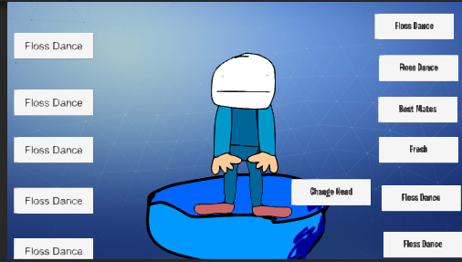

# Fortnite-Emotes-System
This is Fortnite emotes System running in the Unity Engine
To build it you will need the Unity Plus or Unity Pro license to order to this to work and you need to install Visual Studio 2017 or better.

Windows

Microsoft Visual Studio 2019 and Unity 2019.1 or higher.
To Get Custom Faces put it in the Faces folder

